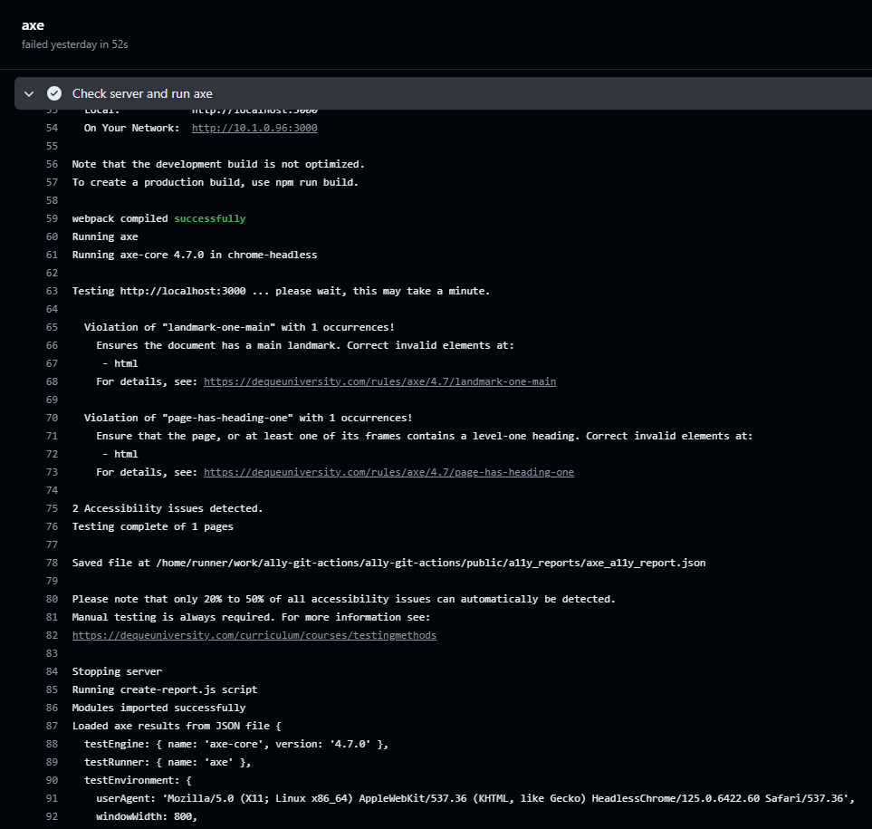
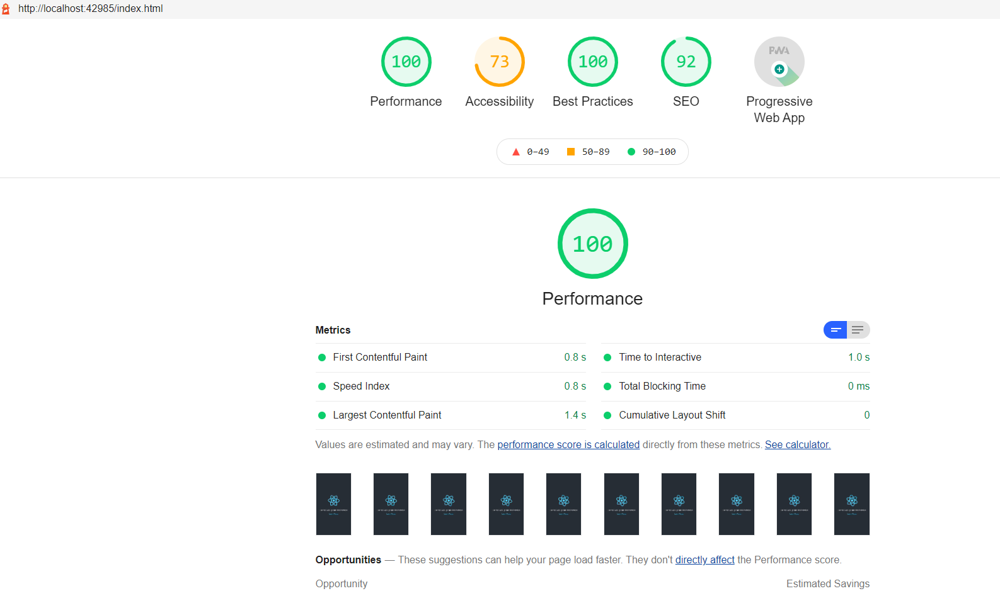

# Accessibility Testing CI/CD Demo with Axe, Lighthouse, and Pa11y

This demo repository showcases the implementation of Continuous Integration/Continuous Deployment (CI/CD) pipelines with accessibility testing using Axe, Lighthouse, and Pa11y in GitHub Actions. The core idea for this project was inspired by SomeAnticsDev's a11y-github-actions, and we have extended it by adding the capability to retrieve the results of the tests as artifacts.

## About the Project

In this project, we have set up CI/CD pipelines that automatically run accessibility tests on every pull request or push to the main branch. These tests help identify accessibility defects early in the development process, making them easier and less costly to fix. The tools we use for these tests include:

### Axe:

An accessibility testing tool that checks for violations according to the Web Content Accessibility Guidelines (WCAG) and provides specific suggestions on how to fix them.

### Lighthouse: 

Google's open-source tool for improving the quality of web pages. It offers audits for performance, accessibility, progressive web apps, SEO and more.

### Pa11y:

A command-line tool for automating accessibility testing of websites. It produces detailed and developer-friendly reports.

## Advantages

**Early Detection of Accessibility Issues:** Integrating accessibility testing into our CI/CD pipeline allows us to detect and fix accessibility issues early in the development cycle.

**Enhanced Web Accessibility:** The tools we use check our code against established WCAG standards, aiding us in creating more accessible websites.

**Improved User Experience:** By adhering to WCAG standards, we ensure a better experience for all users, including those with disabilities.

**Regulatory Compliance:** Many jurisdictions require websites to meet WCAG 2.1 standards. Our pipelines help ensure compliance with these regulations.

## Usage

To use these workflows, you need to have a GitHub Actions workflow file in your repository under .github/workflows. You can then configure this workflow file to run Axe, Lighthouse, and Pa11y tests.

The workflows will run automatically when you make a pull request or push changes to the main branch. Any accessibility issues found will be annotated in the GitHub Actions output, and HTML reports will be generated and uploaded as artifacts.

Ensure to review these reports and fix any issues found to make your application accessible to all users.

## Conclusion

By incorporating accessibility testing into our CI/CD pipelines, we can proactively create websites that are usable by everyone. This approach aligns with our commitment to inclusivity and our aim to provide a superior user experience for all users.

## Acknowledgement

This project was inspired by SomeAnticsDev's a11y-github-actions. We are grateful for the foundation they provided and hope our enhancements offer additional value to those interested in accessibility testing within their CI/CD pipelines.

